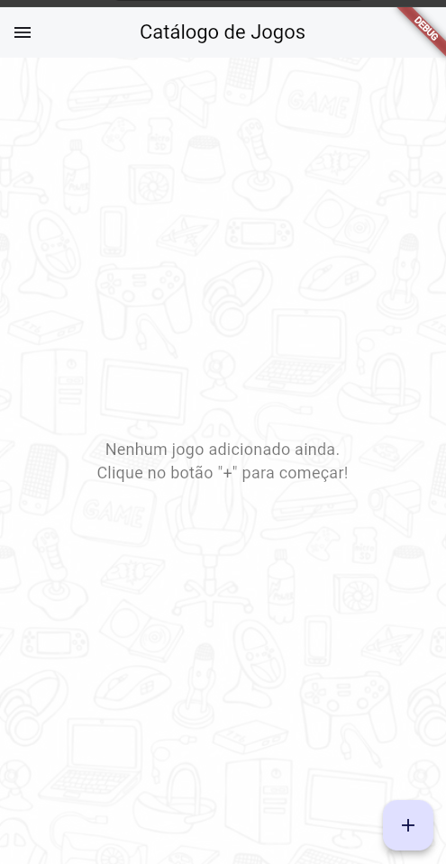
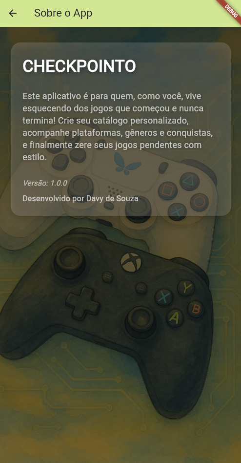
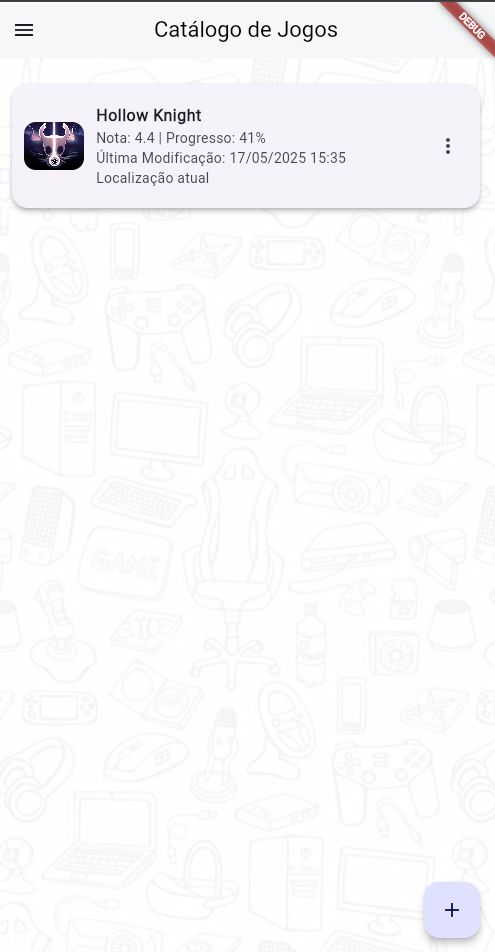
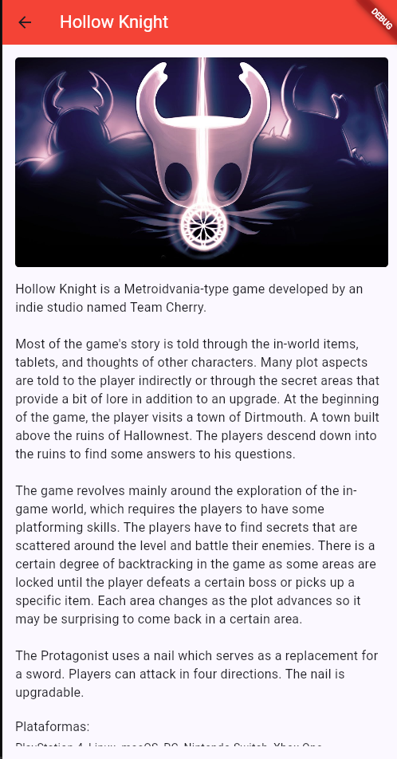
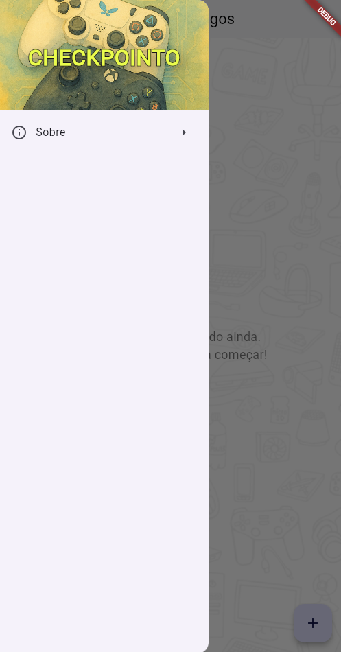

# Catálogo de Jogos 🎮

**Catálogo de Jogos** é um app simples e eficiente para gerenciar e acompanhar seu progresso nos jogos! 🎮📊 Adicione jogos ao seu catálogo, acompanhe seu progresso e veja suas preferências de forma interativa e prática.

## 🚀 Funcionalidades

- **Adicionar jogos**: Procure jogos pela API [RAWG](https://rawg.io/) e adicione ao seu catálogo com um simples clique!
- **Acompanhamento de progresso**: Marque o progresso de cada jogo para lembrar onde parou.
- **Visualização rica**: Exibição das capas dos jogos, notas de avaliação e progresso percentual.
- **Edição e exclusão**: Atualize o progresso ou remova jogos facilmente do catálogo.

## 🧰 Tecnologias Utilizadas

- **Flutter**: Framework principal para o desenvolvimento do app mobile.
- **API RAWG**: Para buscar informações sobre os jogos, como nome, imagem, rating, etc.
- **Material Design**: Interface moderna, limpa e responsiva utilizando os componentes do Flutter.

## 📸 Tela Principal

Ao abrir o app, você será saudado com um **catálogo de jogos** onde poderá ver todos os jogos adicionados, com a opção de editar seu progresso ou excluir jogos já adicionados. Para adicionar um novo jogo, basta clicar no botão de "+" e procurar pelo nome do jogo.

### Funções da Tela Principal:
- **Lista de jogos**: Exibe os jogos que você adicionou ao catálogo.
- **Adicionar jogo**: Busca na API RAWG para sugerir os jogos automaticamente.
- **Editar progresso**: Atualize o progresso do jogo a qualquer momento.
- **Excluir jogo**: Apague um jogo do catálogo.

## 🛠 Como Rodar o Projeto

1. **Clone o repositório:**
   ```bash
   git clone https://github.com/DavyFelix/game_catalog.git
   ```

2. **Entre na pasta do projeto:**
   ```bash
   cd game_catalog
   ```

3. **Instale as dependências do Flutter:**
   ```bash
   flutter pub get
   ```

4. **Execute o aplicativo:**
   ```bash
   flutter run
   ```

> **Nota**: Certifique-se de ter o Flutter instalado em sua máquina. Se não tiver, siga a [documentação oficial](https://flutter.dev/docs/get-started/install) para instalá-lo.

## 📱 Como Funciona?

1. **Busca de jogos**: Ao digitar no campo de busca, a API da RAWG fornece sugestões de jogos.
2. **Adicionar jogo**: Selecione o jogo desejado, defina o progresso e adicione-o ao catálogo.
3. **Gerenciar progresso**: No catálogo, você pode facilmente editar o progresso ou excluir jogos.
4. **Interface interativa**: A interface se adapta automaticamente às mudanças, deixando a experiência fluida.

## 📈 Exemplo de Uso

Adicione jogos com apenas alguns toques! 🔍📈 Abaixo está um exemplo da tela onde você pode buscar um jogo e adicionar ao seu catálogo.

```dart
RawAutocomplete<Map<String, dynamic>>(
  optionsBuilder: (TextEditingValue textEditingValue) async {
    // Faz a requisição à API RAWG
  },
  onSelected: (game) {
    nameController.text = game['name'];
  },
);
```

## 💡 Melhorias Futuras

- **Favoritar jogos**: Adicionar a funcionalidade de marcar jogos favoritos para destaque.
- **Filtrar por gênero**: Permitir filtrar jogos por gênero, como ação, RPG, etc.
- **Melhorar o design**: Adicionar animações e efeitos visuais para uma experiência mais imersiva.

## 📄 Licença 
Este projeto está licenciado sob a licença **MIT** - veja o arquivo [LICENSE](LICENSE) para mais detalhes.

## 📷 Fotos do Projeto 

### 🏠 Página Principal


### ℹ️ Página Sobre


### 🎮 Catálogo com Jogo Inserido


### 📋 Página de Detalhes


### 📂 Drawer Aberto


### 🔁 Página de Atualização


